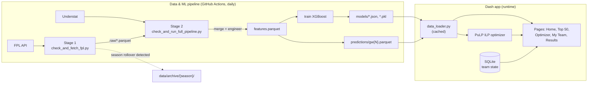

# FPL Intelligence

[](https://github.com/TheodorUtvik/fpl-intelligence/actions/workflows/ci.yml)


An end-to-end data science application for Fantasy Premier League.

Machine learning predicts player points using historical FPL and underlying stats (xG/xA from Understat). Those predictions feed into a Linear Programming optimizer that selects the best squad and recommends transfers under real FPL constraints. Results are surfaced through an interactive Dash dashboard.

---

## What it does

- **Collects data** from the FPL unofficial API (points, minutes, ICT, fixtures) and Understat (xG, xA, shots, key passes) using an async aiohttp client
- **Engineers features** from rolling windows, fixture difficulty, price trends, and underlying performance metrics — strictly without data leakage
- **Trains an XGBoost regressor** to predict next-gameweek points per player, validated with `TimeSeriesSplit` (MAE 0.75, R² 0.61)
- **Optimises squad selection** using Integer Linear Programming (PuLP/CBC) subject to FPL budget, position, and club constraints
- **Advises transfers** given a manager's current squad, available free transfers, and bank
- **Explains predictions** with SHAP waterfall charts per player
- **Serves everything** through a multi-page Dash app: pitch graphics, a squad optimizer, a My Team manager with transfer suggestions, and player profiles
- **Manages a real squad** — import an FPL team by ID, get ranked replacement suggestions per slot, apply/undo transfers with correct bank and free-transfer accounting, persisted in SQLite
- **Runs itself** — a two-stage GitHub Actions pipeline fetches FPL data as soon as a gameweek finishes, waits for Understat to catch up (checked by match count, not a blind timer), then re-engineers features and retrains; season rollovers are detected and archived automatically, no manual reset needed each August

---

## Tech stack

| Layer | Tools |
|---|---|
| Data collection | FPL API, Understat, aiohttp, rapidfuzz |
| Processing | pandas, numpy, pyarrow |
| ML | XGBoost, scikit-learn, SHAP, Optuna |
| Optimisation | PuLP (CBC solver) |
| Dashboard | Dash, Plotly, dash-bootstrap-components |
| Persistence | SQLite |
| CI/CD | GitHub Actions, pytest, ruff |
| Deployment | Gunicorn, Render |

---

## Architecture



Two independent layers, documented in [`CLAUDE.md`](CLAUDE.md) and [`TECHNICAL.md`](TECHNICAL.md): the pipeline runs on a schedule and commits its own outputs back to the repo; the app only ever reads those committed artefacts through the cached `data_loader.py` layer, never touching the network at request time.

---

## Project structure

```
fpl-intelligence/
├── data/
│   ├── raw/                    # FPL + Understat parquet — committed, refreshed by CI
│   ├── processed/               # Merged/feature-engineered datasets (gitignored, rebuilt by Stage 2)
│   ├── predictions/             # Per-GW prediction snapshots — committed
│   └── archive/{season}/        # Previous seasons' data/model artefacts, moved here on rollover
├── notebooks/                   # Original exploratory notebooks (01-07); scripts/ now run headlessly in CI
├── src/
│   ├── data/
│   │   ├── fpl_client.py       # FPL API client (retry/backoff)
│   │   └── understat_client.py # Understat async client (reverse-engineered POST API)
│   ├── features/
│   │   └── engineer.py         # Feature engineering pipeline — leakage guards documented in
│   │                            #   PREDICTION_DATA_INTEGRITY.md, proved in tests/test_engineer.py
│   ├── models/
│   │   ├── predict.py          # XGBoost training and inference
│   │   └── optimize.py         # PuLP ILP squad optimizer + transfer advisor
│   └── utils.py                 # Season detection, GW-completeness threshold, rollover archiving
├── scripts/
│   ├── check_and_fetch_fpl.py         # Stage 1 — FPL fetch (CI, daily)
│   ├── check_and_run_full_pipeline.py # Stage 2 — Understat + merge + retrain (CI, daily)
│   ├── refresh_pipeline.py            # Manual full refresh (local, hits both APIs)
│   ├── rebuild_from_local_data.py     # Rebuild merge/features/model from data/raw/ only — no API calls
│   └── build_id_map.py                # Rebuild the FPL<->Understat player ID map
├── app/
│   ├── app.py                  # Dash app entry point (Flask server exposed for Gunicorn)
│   ├── data_loader.py          # Cached data loading shared across pages — cold-start safe
│   ├── db.py / team_manager.py # SQLite persistence + squad business logic
│   ├── assets/custom.css
│   ├── components/              # sidebar, navbar, pitch graphic, club badges, warming-up state
│   └── pages/
│       ├── home.py             # Dashboard overview with KPIs and charts
│       ├── optimizer.py        # Squad optimizer with pitch visual
│       ├── my_team.py          # Import a real squad, get transfer suggestions, apply/undo
│       ├── top50.py            # Sortable leaderboard with player links
│       ├── results.py          # Predicted vs actual points, GW by GW
│       └── player.py           # Player profile with form, xG/xA and SHAP charts
├── tests/                       # pytest — leakage guards, ILP constraints, transfer logic, cold-start
├── models/                      # Saved model artefacts (committed — CI rebuilds them)
├── .github/workflows/           # ci.yml, refresh_fpl.yml, refresh_full.yml
├── Procfile                     # Gunicorn entry point for Render
├── render.yaml                  # Render Blueprint (web service, dev branch, gunicorn start command)
├── requirements.txt / requirements-dev.txt
└── README.md
```

---

## Setup

```bash
git clone https://github.com/TheodorUtvik/fpl-intelligence.git
cd fpl-intelligence
python -m venv venv
source venv/bin/activate       # Windows: venv\Scripts\activate
pip install -r requirements.txt
```

### Run the full pipeline (fetch, merge, engineer, train)

```bash
python scripts/refresh_pipeline.py
```

Fetches FPL + Understat data, merges them, engineers features, and retrains the model — the same steps the CI workflows run automatically each day. Needs `data/processed/player_id_map.parquet` to exist first; build it with `python scripts/build_id_map.py`.

The original exploratory work (`notebooks/01`–`07`) walks through each of these steps individually and is kept for reference — the scripts above are what actually runs in production now.

### Run the dashboard

```bash
python -m app.app
# Open http://127.0.0.1:8050
```

### Run the tests

```bash
pip install -r requirements-dev.txt
ruff check .
pytest
```

---

## Model performance

| Metric | Value |
|---|---|
| Model | XGBoost regressor |
| MAE (test set, GW27–30, 2025/26 season) | **0.75 pts** |
| R² (test set, 2025/26 season) | **0.61** |
| Baseline MAE (rolling 3GW avg) | 1.00 pts |
| Improvement vs baseline | **25%** |
| xG coverage (players with minutes) | ~70% |

The test set uses a strict time-based holdout (future gameweeks never seen during training) via `TimeSeriesSplit`. These numbers are from the 2025/26 season's model, now archived at `data/archive/2025-26/`. **Training is deliberately current-season-only** — no cross-season rows are ever mixed in, since player performance can shift significantly between seasons and clubs — so the 2026/27 model starts from nothing each season and these metrics will be refreshed once enough current-season gameweeks have accrued to retrain and evaluate on (see the Model Performance page in the app, and the planned predicted-vs-actual tracker in the Roadmap below).

---

## Optimizer constraints

The ILP selects a squad satisfying:
- Budget ≤ £100m
- Exactly 2 GKP, 5 DEF, 5 MID, 3 FWD (full squad) — or valid formation for starting XI
- Maximum 3 players per club
- Captain selected as highest predicted scorer

---

## Roadmap

- [x] Phase 1 — Environment and project setup
- [x] Phase 2 — Data collection (FPL API + Understat)
- [x] Phase 3 — Feature engineering
- [x] Phase 4 — Modelling (XGBoost + SHAP)
- [x] Phase 5 — Hyperparameter tuning (Optuna)
- [x] Phase 6 — LP optimizer (PuLP)
- [x] Phase 7 — Dash dashboard
- [x] Phase 8 — My Team: real squad import, transfer suggestions, SQLite persistence
- [x] Phase 9 — Automated CI pipeline with season-rollover handling and a test/lint quality gate
- [ ] Phase 10 — Deployment (Render)
- [x] Phase 11 — Predicted-vs-actual accuracy tracker (GW Results page)
- [ ] Phase 12 — Backtesting

---

## Known limitations and design decisions

- **Training is current-season-only by design, not a limitation to fix** — player performance shifts too much season to season and club to club to justify mixing in prior-season rows. The practical cost: no predictions for the first ~1-2 gameweeks of a new season, until enough current-season data exists to train on (the app shows an explicit "season warming up" state rather than a stale or cross-season-contaminated prediction).
- xG coverage ~70% — some player names do not fuzzy-match between FPL and Understat; see `scripts/build_id_map.py`'s `review`-status output.
- Model does not account for opponent defensive strength split by home/away — planned feature.
- Player availability probability (`chance_of_playing_next_round`) not yet used as a model feature, only as a status filter.
- Budget slider on the optimizer not yet implemented (the ILP already supports a `budget` parameter).
- **Single-user mode by design** — the SQLite schema (`app/db.py`) supports multiple users, but `DEFAULT_USER_ID` is hardcoded and there's one shared team. The My Team page discloses this to visitors before any public deploy.
